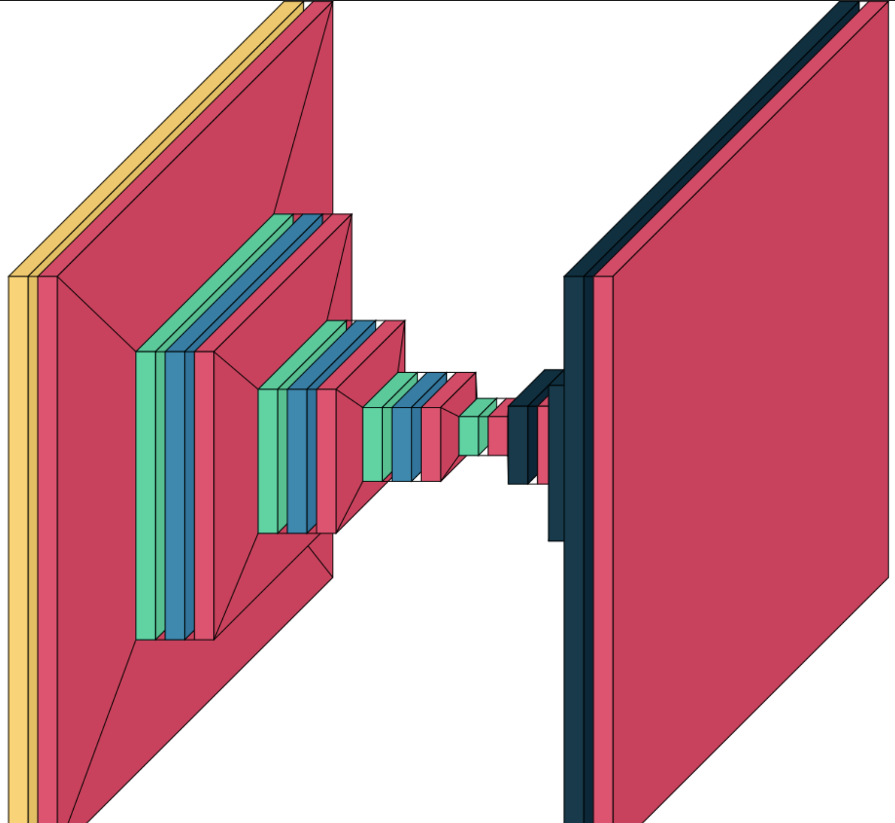

# Image Denoising Using AutoEncoder Architecture
## Introduction:
Autoencoders are a class of artificial neural networks that have gained prominence in various domains of machine learning and computer vision, particularly for their remarkable capabilities in image denoising. These neural networks are designed with a simple yet powerful architecture that has proven to be highly effective in capturing intricate features and reducing noise in digital images.

The core concept behind autoencoders revolves around the idea of learning efficient data representations, often referred to as encoding or compression, and then reconstructing the original input from these learned representations. In essence, autoencoders strive to create a compact and informative internal representation of the input data while maintaining the capacity to regenerate it with minimal loss of information.

## Image Denoising:
One of the most intriguing applications of autoencoders is image denoising, wherein these neural networks excel in restoring images that have been corrupted by various types of noise, such as Gaussian noise, salt-and-pepper noise, or even sensor-specific noise. By training on a dataset of noisy-clean image pairs, autoencoders learn to distinguish between noise and signal, effectively extracting valuable image features while eliminating the interference of unwanted artifacts.

In this context, the encoder of the autoencoder learns to identify the noise patterns and encodes the denoised image's structure into a compact representation. The decoder then utilizes this encoded information to regenerate a clean version of the image. The reconstruction process ensures that the denoised output closely resembles the original image while reducing the impact of noise. This powerful capability of autoencoders has made them a popular choice for a wide range of image denoising applications, including medical image processing, astronomical image analysis, and more.
## Dataset:
https://www.kaggle.com/datasets/rajat95gupta/smartphone-image-denoising-dataset